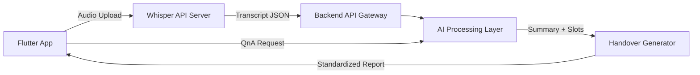

# MediRelay Flutter

AI-Powered Nursing Handover Automation – Flutter Mobile App

---

## Project Overview

MediRelay is a Flutter-based mobile solution that **automates the creation of nursing handover documents**.
It extracts and summarizes key information from EMR nursing records and generates standardized handover reports.


---

## Architecture Overview



---

## Tech Stack

* **Frontend**: Flutter 3.16 (Dart 3.0)
* **Backend Gateway**: Node.js (Express, Passport.js, JWT, RBAC)
* **AI Processing Layer**:

  * Whisper API (Speech-to-Text)
  * KoBERT (Slot classification)
  * KoBART (Summarization)
  * OpenAI GPT API (Fallback summarization/QnA)
* **Database**: PostgreSQL (server), SQLite (mobile local cache)
* **Networking**: REST API (JSON), dio (Flutter client)

---

## API Endpoints

### Authentication

```
POST   /api/auth/login
POST   /api/auth/logout
```

### Patients

```
GET    /api/patients               # List of patients
GET    /api/patients/:id           # Patient details
```

### Voice Recording / Whisper

```
POST   /api/voice/upload           # Upload audio file (m4a/webm)
→ Calls Whisper API → Returns transcript
```

### Nursing Records

```
POST   /api/records                # Save nursing record
GET    /api/records/:patientId     # Retrieve patient’s records
```

### Handover

```
POST   /api/handover/generate      # Generate handover document
GET    /api/handover/:patientId    # Retrieve handover document
```

### Chatbot (QnA)

```
POST   /api/chat/query             # Submit query
```

---

## Model Architecture

### Whisper (STT)

* Input: `.m4a` / `.webm` audio file
* Output: JSON { "transcript": "..." }

### Slot Classification (KoBERT)

* Input: Transcript text
* Output: { "vital\_change": true, "medication": "Tylenol", ... }

### Summarization (KoBART / GPT)

* Input: Nursing text + Slot results
* Output: One-line summary (e.g., `"BT 37.9℃ → Tylenol administered, monitoring fever response"`)

### Handover Generator

* Input: Slots + summary results
* Output: Standardized handover document (JSON/Markdown)

---

## Flutter Project Structure

```
lib/
├── core/               # Constants, networking, utilities
├── features/
│   ├── patients/       # Patient list
│   ├── voice_recording # Audio recording + Whisper API integration
│   ├── nursing_records # Record creation and retrieval
│   ├── handover/       # Automated handover generation
│   └── chat/           # QnA chatbot
├── shared/             # Common widgets
└── app.dart
```

---

## Data Flow (Example)

1. **Patient Selection**

   * `/patients/:id` → Displayed in Flutter app

2. **Voice Recording**

   * Flutter → `/voice/upload` → Whisper API → Transcript JSON

3. **Slot Classification & Summarization**

   * Transcript → `/handover/generate`
   * KoBERT classification + KoBART summarization → Draft handover

4. **View Handover**

   * Flutter app fetches patient’s handover document

5. **QnA**

   * Flutter → `/chat/query` → GPT API → Response

---

## Local Setup

### Backend

```bash
cd backend
npm install
npm run dev
```

### Flutter

```bash
flutter pub get
flutter run
```

---

## Development Process

### Web Prototype

* Built with React + Vite (QR scanning, voice recording → Whisper API, record/handover/chatbot validation)
* Deployed on GitHub Pages, tested user flows and AI summarization

### Flutter Migration

* Rebuilt as a mobile-first app
* Features: voice recording, Whisper API integration, OpenAI API-based summarization and handover generation
* Introduced structured state management (Bloc), local caching (SQLite), and backend persistence (PostgreSQL)

---

## Achievements & Awards

* 2025 Seoul AI Hub – SAY Track Finalist & Graduation
* 2025 Yonsei University Y-Compass Student Startup Team (Grade A completion)
* 2025 Pusan National University – 9th Digital Healthcare MEDICAL HACK, **Grand Prize** (President’s Award)
* 2025 Ministry of Education – **Top 300 Student Startup Teams (U300+)** Finalist

---

## References

* [Web Prototype Repository](https://github.com/5seoyoung/medirelay-prototype)
* [Service Intro Page (Notion)](https://unleashed-oil-858.notion.site/medix-medirelay)
